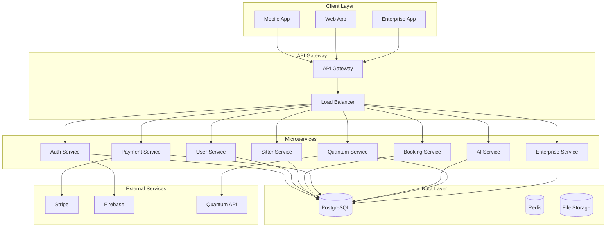

# NannyRadar System Architecture

## Overview

NannyRadar employs a modern, cloud-native microservices architecture with quantum-enhanced security and AI capabilities. The system is designed for scalability, reliability, and advanced research integration.

## High-Level Architecture

## Technology Stack

### Backend
- **Framework**: NestJS (Node.js)
- **Database**: PostgreSQL (primary), SQLite (development)
- **ORM**: TypeORM
- **Authentication**: JWT + Passport
- **API Documentation**: Swagger/OpenAPI
- **Testing**: Jest
- **Validation**: Class-validator

### Frontend
- **Mobile**: React Native
- **Web**: React.js
- **State Management**: Redux Toolkit
- **UI Framework**: NativeBase/Chakra UI
- **Navigation**: React Navigation
- **Real-time**: Socket.io

### Infrastructure
- **Cloud**: AWS/Azure
- **Containerization**: Docker
- **Orchestration**: Kubernetes
- **CI/CD**: GitHub Actions
- **Monitoring**: Prometheus + Grafana
- **Logging**: ELK Stack

### Quantum & AI
- **Quantum Computing**: IBM Qiskit, Google Cirq
- **Machine Learning**: TensorFlow, PyTorch
- **AI Services**: OpenAI API, Custom Models
- **Quantum Security**: CRYSTALS-Kyber, CRYSTALS-Dilithium

## Microservices Architecture

### 1. Authentication Service
- User registration and login
- JWT token management
- OAuth integration
- Multi-factor authentication
- Quantum-secured sessions

### 2. User Service
- User profile management
- Parent and sitter profiles
- Verification and background checks
- Preferences and settings

### 3. Sitter Service
- Sitter registration and onboarding
- Availability management
- Certification tracking
- Performance analytics
- Earnings management

### 4. Booking Service
- Booking creation and management
- Scheduling and calendar integration
- Real-time status updates
- Check-in/check-out tracking
- Emergency protocols

### 5. Payment Service
- Stripe integration
- Payment processing
- Invoice generation
- Refund management
- Financial reporting

### 6. AI Service
- Sitter matching algorithms
- Recommendation engine
- Predictive analytics
- Natural language processing
- Computer vision

### 7. Quantum Service
- Quantum key generation
- Quantum encryption/decryption
- Quantum communication
- Quantum analytics
- Quantum optimization

### 8. Enterprise Service
- White-label solutions
- API management
- Compliance reporting
- Advanced analytics
- Custom integrations

## Data Architecture

### Database Design
- **Primary Database**: PostgreSQL
- **Caching**: Redis
- **File Storage**: AWS S3/Azure Blob
- **Search**: Elasticsearch
- **Analytics**: ClickHouse

### Data Models
- **Users**: Parents, Sitters, Admins
- **Profiles**: Detailed user information
- **Bookings**: Service requests and scheduling
- **Payments**: Financial transactions
- **Reviews**: Feedback and ratings
- **Messages**: Real-time communication
- **Notifications**: System alerts
- **Verifications**: Background checks and certifications

## Security Architecture

### Quantum Security
- **Key Generation**: Quantum random number generation
- **Encryption**: Post-quantum cryptography
- **Communication**: Quantum key distribution
- **Authentication**: Quantum-resistant protocols

### Traditional Security
- **Zero Trust**: Never trust, always verify
- **End-to-End Encryption**: All data encrypted in transit and at rest
- **API Security**: Rate limiting, input validation, authentication
- **Infrastructure Security**: Network segmentation, firewalls, DDoS protection

## Scalability & Performance

### Horizontal Scaling
- Microservices can scale independently
- Load balancing across multiple instances
- Database sharding and replication
- CDN for static content delivery

### Performance Optimization
- Caching strategies (Redis, CDN)
- Database query optimization
- API response compression
- Real-time data streaming

### Monitoring & Observability
- Application Performance Monitoring (APM)
- Distributed tracing
- Log aggregation and analysis
- Real-time alerting
- Health checks and metrics

## Deployment Architecture

### Development Environment
- Local development with Docker Compose
- SQLite for rapid development
- Hot reloading for both frontend and backend
- Mock services for external dependencies

### Staging Environment
- Production-like environment
- Full integration testing
- Performance testing
- Security testing

### Production Environment
- Multi-region deployment
- Auto-scaling based on demand
- Blue-green deployments
- Disaster recovery procedures

## API Design

### RESTful APIs
- RESTful design principles
- OpenAPI 3.0 specification
- Versioned APIs (v1, v2)
- Consistent error handling
- Rate limiting and throttling

### GraphQL (Future)
- Flexible data querying
- Real-time subscriptions
- Schema federation
- Performance optimization

## Integration Architecture

### External Services
- **Stripe**: Payment processing
- **Firebase**: Push notifications
- **Google Maps**: Location services
- **Twilio**: SMS and voice
- **SendGrid**: Email services
- **Quantum APIs**: IBM, Google, Microsoft

### Internal APIs
- Service-to-service communication
- Event-driven architecture
- Message queues (RabbitMQ/Apache Kafka)
- API gateway routing

## Disaster Recovery

### Backup Strategy
- Daily database backups
- Real-time data replication
- Cross-region backup storage
- Point-in-time recovery

### Failover Procedures
- Automatic failover to backup regions
- Database failover and recovery
- Service degradation strategies
- Communication protocols

## Compliance & Governance

### Data Governance
- Data classification and handling
- Privacy by design
- Audit trails and logging
- Data retention policies

### Regulatory Compliance
- SOC 2 Type II controls
- GDPR compliance framework
- CCPA compliance measures
- Industry-specific regulations
